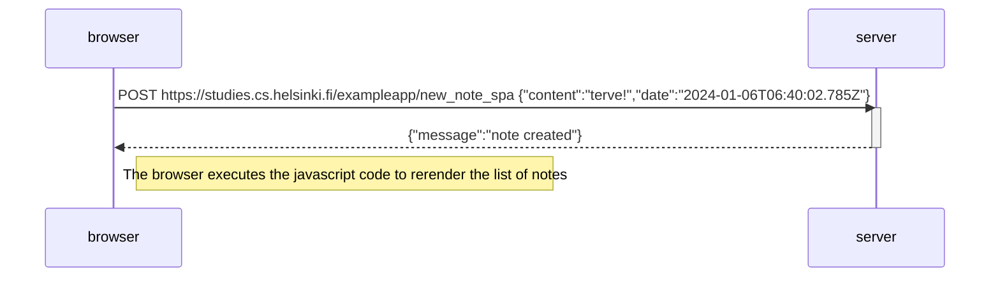

```mermaid
sequenceDiagram
    participant browser
    participant server

    browser->>server: POST https://studies.cs.helsinki.fi/exampleapp/new_note_spa {"content":"terve!","date":"2024-01-06T06:40:02.785Z"}
    activate server
    server-->>browser: {"message":"note created"}
    deactivate server

    Note right of browser: The browser executes the javascript code to rerender the list of notes
```